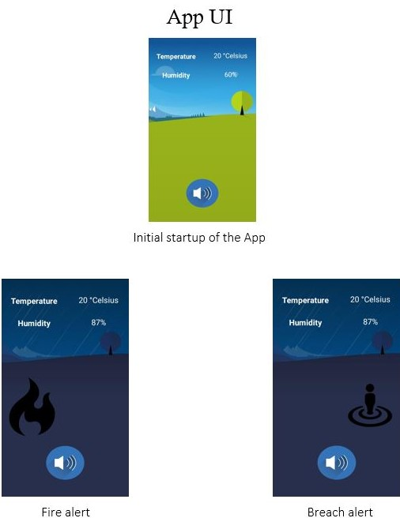
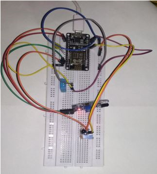

# surveillance-system-
This project is an IOT based surveillance system.
This project uses NODE MCU as the microcontroller along with an ultrasonic sensor and an led.
In the software side, MIT APP inventor and Google Firebase has been used for developing the app.
Real time data of the distance is send to the app and it also consist of a led/buzzer which can be controlled by the app.

                                                 

                                               
